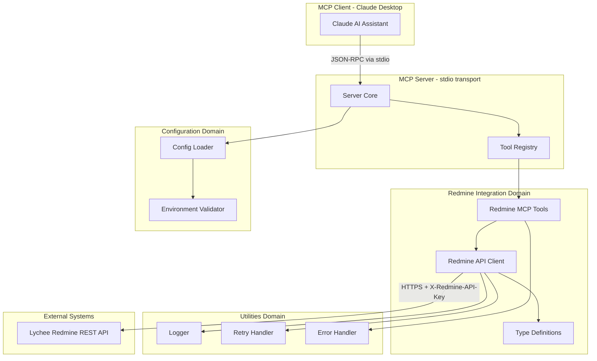
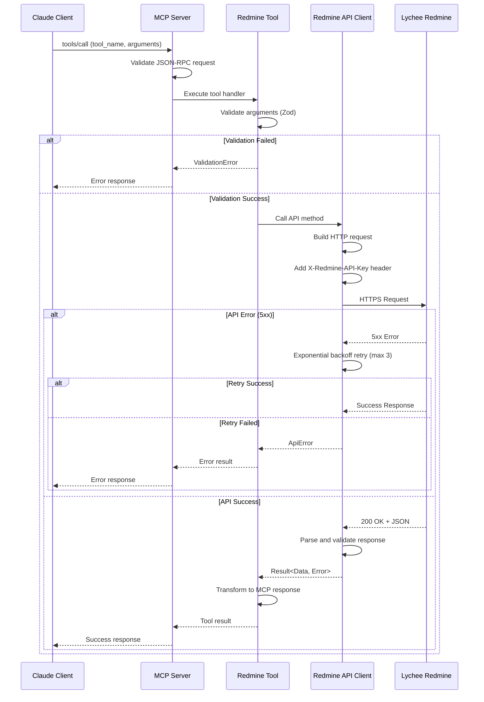
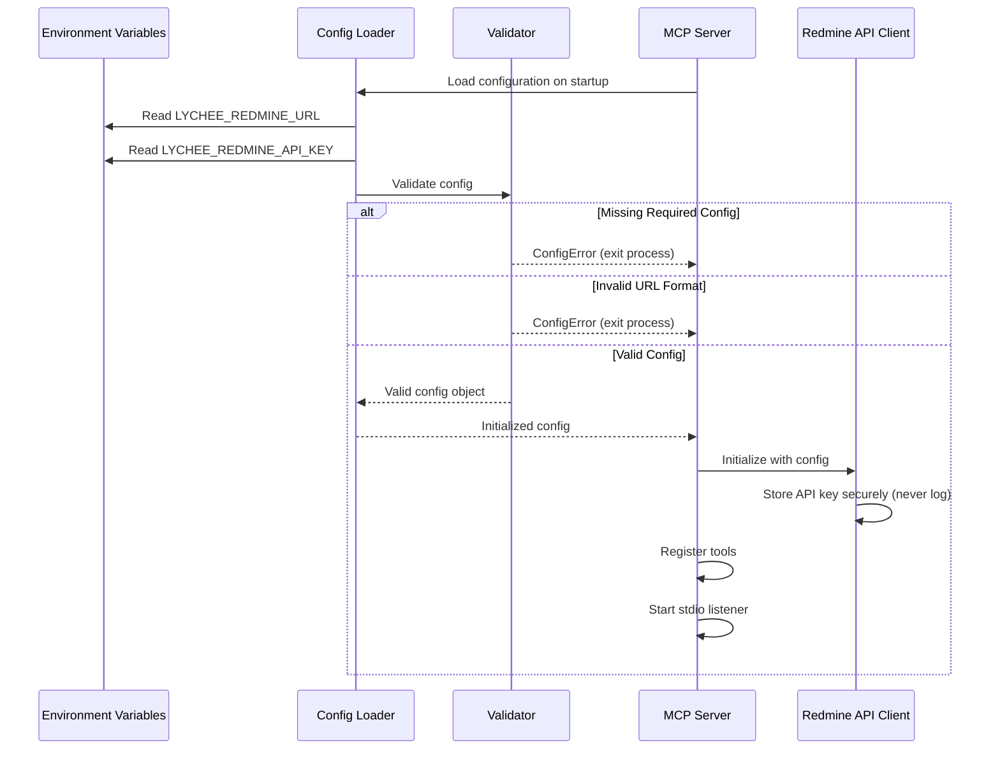

# Technical Design Document

## Overview

本機能は、Lychee RedmineプロジェクT管理ツールとAIアシスタント（Claude等）を統合するModel Context Protocol (MCP)サーバーを提供します。MCPサーバーはstdio経由でJSON-RPC 2.0プロトコルを実装し、Lychee RedmineのREST APIを介してプロジェクト情報取得、チケット操作、リソース管理などの機能を公開します。

**Purpose**: Lychee Redmineの操作をAIアシスタントから実行可能にし、プロジェクト管理タスクの自動化と効率化を実現します。

**Users**: AIアシスタント統合を利用するプロジェクトマネージャー、開発者、システム管理者が対象です。

**Impact**: 既存のLychee Redmineシステムには影響を与えず、新規の統合レイヤーとして動作します。

### Goals
- MCP標準プロトコルに準拠したサーバー実装（stdio トランスポート）
- Lychee Redmine REST APIの安全かつ効率的な統合
- TypeScript strict modeによる型安全な実装
- テストカバレッジ80%以上の高品質コードベース

### Non-Goals
- Lychee Redmine本体の変更や拡張
- Web UIの提供（MCP Serverのみ）
- リアルタイム通知機能（WebSocketベース）
- フェーズ1での高度なLychee Redmine機能実装（EVM指標、コスト管理、プロジェクトレポート履歴）

**フェーズ2以降で検討するLychee固有機能**:
- EVM (Earned Value Management) 指標取得 (`/levm/api/...`)
- コスト管理・経費情報 (`/lychee_cost_expenses.json`)
- プロジェクトレポート履歴 (`/project_reports/histories.json`)
- 実労働時間インポート (`/lychee_time_management/api/...`)
- ベースライン管理 (`/baselines`)

## Architecture

### Architecture Pattern & Boundary Map

**選択パターン**: Domain-Driven Design (DDD) with Layered Architecture

**Domain/Feature Boundaries**:
- **MCP Server Core** (`/src/server/`): プロトコル実装、ツール/リソース登録、JSON-RPCハンドリング
- **Redmine Integration** (`/src/redmine/`): REST APIクライアント、型定義、MCPツール実装
- **Configuration** (`/src/config/`): 環境変数読み込み、設定バリデーション
- **Utilities** (`/src/utils/`): ログ、エラーハンドリング、リトライロジック



**Architecture Integration**:
- **Selected Pattern**: Domain-Driven Design with clear domain boundaries
- **Rationale**: Steeringガイドライン（structure.md）の「機能ドメイン分離」原則に準拠し、各ドメインの独立性とテスト可能性を確保
- **Domain Boundaries**: MCP Server、Redmine統合、設定管理、ユーティリティを明確に分離
- **Existing Patterns Preserved**: なし（新規プロジェクト）
- **New Components Rationale**: 各ドメインが単一責任を持ち、依存関係が一方向（Server → Redmine Integration → Utilities）
- **Steering Compliance**: 型安全性、テスト可能性、ドメイン独立性の原則を遵守

### Technology Stack & Alignment

| Layer | Choice / Version | Role in Feature | Notes |
|-------|------------------|-----------------|-------|
| Runtime | Node.js 20+ | JavaScript実行環境 | Steering標準、型ストリッピング機能（22.18.0+） |
| Language | TypeScript 5.x (strict mode) | 型安全な実装 | `any`型禁止、完全な型定義 |
| MCP SDK | @modelcontextprotocol/sdk@1.25.1 | MCPプロトコル実装 | stdio/HTTP トランスポート、ツール/リソース/プロンプトサポート |
| Validation | zod@3.25+ | ランタイムバリデーション | MCP SDK必須ピア依存関係、JSON Schemaバリデーション |
| HTTP Client | axios@1.x | REST API通信 | タイムアウト、リトライ、インターセプター機能 |
| Testing | vitest | ユニット/統合テスト | 高速、TypeScript完全サポート |
| Code Quality | ESLint + Prettier | 静的解析とフォーマット | Steering標準 |

**Technical Decisions Summary**:
- **stdioトランスポート**: ローカル統合（Claudeデスクトップアプリ）向け、リモートアクセス不要
- **Zodバリデーション**: TypeScript型とランタイムバリデーションの一元化、MCP仕様のJSON Schemaへ自動変換
- **Result<T, E>型**: 関数型エラーハンドリングによる型安全性確保

詳細な技術選定理由と代替案評価は`research.md`を参照。

## System Flows

### MCP Tool Invocation Flow



**Key Decisions**:
- Zodバリデーションはツールハンドラー内で実行し、早期エラー検出
- 5xxエラー時のみリトライ（4xxはクライアントエラーのため即座に返却）
- API レスポンスは型安全なResult<T, E>で処理

### Authentication & Configuration Flow



**Key Decisions**:
- 起動時に必須設定項目を検証し、不正な場合は即座に終了
- APIキーは平文ログ出力禁止（セキュリティ要件2.2）
- 環境変数優先（設定ファイルより優先度が高い）

## Requirements Traceability

| Requirement | Summary | Components | Interfaces | Flows |
|-------------|---------|------------|------------|-------|
| 1.1, 1.2, 1.5 | MCP Server基盤 | Server Core, Tool Registry | ServerService, ToolHandler | Tool Invocation |
| 1.3, 1.4 | Node.js/TypeScript実装 | 全コンポーネント | - | - |
| 2.1, 2.2, 2.3, 2.4, 2.5, 2.6 | API認証 | Config Loader, Redmine API Client | ConfigService, AuthClient | Authentication & Configuration |
| 3.1, 3.2, 3.3, 3.4, 3.5 | プロジェクト情報取得 | Redmine API Client, get_projects/get_project tools | ProjectsAPI | Tool Invocation |
| 4.1, 4.2, 4.3, 4.4, 4.5, 4.6, 4.7 | チケット操作 | Redmine API Client, search_issues/create_issue/update_issue tools | IssuesAPI | Tool Invocation |
| 5.1, 5.2, 5.3, 5.4 | リソース管理 | Redmine API Client, get_users/get_project_members tools | UsersAPI, MembersAPI | Tool Invocation |
| 6.1, 6.2, 6.3, 6.4 | スケジュール情報 | get_schedule tool | ScheduleAPI | Tool Invocation |
| 7.1, 7.2, 7.3, 7.4, 7.5 | エラーハンドリング | Retry Handler, Error Handler, Logger | RetryService, ErrorService | Tool Invocation (retry logic) |
| 8.1, 8.2, 8.3, 8.4, 8.5 | ログと監視 | Logger | LoggerService | All flows |
| 9.1, 9.2, 9.3, 9.4, 9.5 | 型安全性とバリデーション | Type Definitions, Zod Schemas | - | Tool Invocation (validation) |
| 10.1, 10.2, 10.3, 10.4, 10.5 | 設定管理 | Config Loader, Environment Validator | ConfigService | Authentication & Configuration |
| 11.1, 11.2, 11.3, 11.4, 11.5 | テスト可能性 | 全コンポーネント | - | - |
| 12.1, 12.2, 12.3, 12.4, 12.5 | MCPプロトコル機能 | Server Core, Tool Registry, All Tools | ServerService, ToolHandler | Tool Invocation |

## Components and Interfaces

### Component Summary

| Component | Domain/Layer | Intent | Req Coverage | Key Dependencies (Criticality) | Contracts |
|-----------|--------------|--------|--------------|--------------------------------|-----------|
| Server Core | MCP Server | MCPプロトコル実装、ツール登録 | 1.1, 1.2, 1.5, 12.1, 12.2 | @modelcontextprotocol/sdk (P0), ConfigLoader (P0) | Service |
| Tool Registry | MCP Server | ツール定義とハンドラーマッピング | 12.1, 12.2, 12.3 | Redmine Tools (P0) | Service |
| Redmine API Client | Redmine Integration | REST API通信とレスポンス処理 | 2.1-2.6, 3.1-3.5, 4.1-4.7, 5.1-5.4, 6.1-6.4 | axios (P0), RetryHandler (P0), Logger (P1) | Service, API |
| Redmine MCP Tools | Redmine Integration | MCPツール実装（8つのツール） | 3.1-3.5, 4.1-4.7, 5.1-5.4, 6.1-6.4, 12.1 | Redmine API Client (P0), Zod (P0) | Service |
| Config Loader | Configuration | 環境変数/設定ファイル読み込み | 10.1, 10.2, 10.3, 10.4 | EnvValidator (P0) | Service |
| Environment Validator | Configuration | 設定バリデーション | 2.3, 10.3, 10.5 | - | Service |
| Logger | Utilities | 構造化ログ出力 | 8.1, 8.2, 8.3, 8.4, 8.5 | - | Service |
| Retry Handler | Utilities | 指数バックオフリトライ | 7.1, 7.2, 7.5 | Logger (P1) | Service |
| Error Handler | Utilities | エラー変換と標準化 | 7.2, 7.3, 7.4 | - | Service |

### MCP Server Domain

#### Server Core

| Field | Detail |
|-------|--------|
| Intent | MCPプロトコルの実装とクライアント通信管理 |
| Requirements | 1.1, 1.2, 1.5, 12.1, 12.2 |

**Responsibilities & Constraints**
- stdio経由のJSON-RPC 2.0プロトコル実装
- ツール/リソース/プロンプトの登録と公開
- クライアント初期化リクエストの処理
- 設定エラー時の適切な終了処理

**Dependencies**
- Inbound: なし（エントリーポイント）
- Outbound: ToolRegistry — ツール定義の取得 (P0)
- Outbound: ConfigLoader — 設定読み込み (P0)
- External: @modelcontextprotocol/sdk@1.25.1 — MCPプロトコル実装 (P0)

**Contracts**: [x] Service

##### Service Interface

```typescript
interface ServerService {
  /**
   * サーバーを起動し、stdio経由でMCPクライアントとの通信を開始
   * @throws ConfigError 設定が不正な場合
   */
  start(): Promise<Result<void, ConfigError>>;

  /**
   * サーバーを正常終了
   */
  shutdown(): Promise<void>;

  /**
   * ツールを登録
   */
  registerTool(tool: MCPToolDefinition): void;
}

interface MCPToolDefinition {
  name: string;
  description: string;
  inputSchema: ZodSchema;
  handler: ToolHandler;
}

type ToolHandler<TInput = unknown, TOutput = unknown> = (
  args: TInput
) => Promise<Result<TOutput, ToolError>>;
```

- **Preconditions**: 有効な設定が環境変数に存在する
- **Postconditions**: サーバーがstdio経由でリクエストを受け付ける状態
- **Invariants**: サーバー起動後はシャットダウンまで継続動作

**Implementation Notes**
- **Integration**: @modelcontextprotocol/sdk の Server クラスを使用し、StdioServerTransport でstdio通信を実装
- **Validation**: 起動時にConfigLoaderを呼び出し、設定バリデーション失敗時は即座に終了（要件1.5）
- **Risks**: stdioトランスポートはローカル統合のみサポート（リモートアクセス不可）

#### Tool Registry

| Field | Detail |
|-------|--------|
| Intent | ツール定義の管理とハンドラーマッピング |
| Requirements | 12.1, 12.2, 12.3 |

**Responsibilities & Constraints**
- MCPツールの登録と管理
- ツール一覧の公開（tools/list）
- ツール実行リクエストのルーティング

**Dependencies**
- Inbound: Server Core — ツール登録 (P0)
- Outbound: Redmine MCP Tools — ツールハンドラー取得 (P0)

**Contracts**: [x] Service

##### Service Interface

```typescript
interface ToolRegistryService {
  /**
   * すべてのツール定義を取得
   */
  listTools(): MCPToolDefinition[];

  /**
   * ツール名からハンドラーを取得
   */
  getTool(name: string): Result<MCPToolDefinition, ToolNotFoundError>;
}
```

- **Preconditions**: すべてのツールが事前に登録されている
- **Postconditions**: クライアントがツール一覧とスキーマを取得可能
- **Invariants**: 同一ツール名の重複登録不可

**Implementation Notes**
- **Integration**: Map<string, MCPToolDefinition>でツールを管理
- **Validation**: ツール登録時に名前の重複チェック
- **Risks**: なし

### Redmine Integration Domain

#### Redmine API Client

| Field | Detail |
|-------|--------|
| Intent | Lychee Redmine REST APIとの通信とレスポンス処理 |
| Requirements | 2.1, 2.2, 2.3, 2.4, 2.5, 2.6, 3.1, 3.2, 3.3, 3.4, 3.5, 4.1, 4.2, 4.3, 4.4, 4.5, 4.6, 4.7, 5.1, 5.2, 5.3, 5.4, 6.1, 6.2, 6.3, 6.4 |

**Responsibilities & Constraints**
- `X-Redmine-API-Key`ヘッダーによる認証
- HTTPS通信の強制
- ページネーション対応
- レスポンスの型安全な処理
- APIキーの平文ログ出力禁止

**Dependencies**
- Inbound: Redmine MCP Tools — API呼び出し (P0)
- Outbound: RetryHandler — リトライロジック (P0)
- Outbound: Logger — API呼び出しログ (P1)
- External: Lychee Redmine REST API — データソース (P0)
- External: axios@1.x — HTTP通信 (P0)

**Contracts**: [x] Service [x] API

##### Service Interface

```typescript
interface RedmineAPIClient {
  // Projects
  getProjects(params: GetProjectsParams): Promise<Result<ProjectsResponse, ApiError>>;
  getProject(id: number): Promise<Result<Project, ApiError>>;

  // Issues
  searchIssues(params: SearchIssuesParams): Promise<Result<IssuesResponse, ApiError>>;
  createIssue(params: CreateIssueParams): Promise<Result<Issue, ApiError>>;
  updateIssue(id: number, params: UpdateIssueParams): Promise<Result<Issue, ApiError>>;

  // Users
  getUsers(params: GetUsersParams): Promise<Result<UsersResponse, ApiError>>;
  getProjectMembers(projectId: number): Promise<Result<MembersResponse, ApiError>>;

  // Lychee-specific: Milestones (for Gantt chart data)
  getMilestones(projectId: number): Promise<Result<MilestonesResponse, ApiError>>;

  // Schedule (aggregates Issues + Milestones)
  getSchedule(projectId: number): Promise<Result<Schedule, ApiError>>;
}

// Common types
interface PaginationParams {
  limit?: number; // default: 25
  offset?: number; // default: 0
}

interface PaginatedResponse<T> {
  data: T[];
  total_count: number;
  limit: number;
  offset: number;
}

type Result<T, E> =
  | { ok: true; value: T }
  | { ok: false; error: E };

interface ApiError {
  code: number;
  message: string;
  endpoint: string;
  timestamp: string;
  requestId?: string;
}
```

- **Preconditions**: 有効なAPIキーとURLが設定されている
- **Postconditions**: API レスポンスが型安全に処理される
- **Invariants**: APIキーは平文でログに出力されない

##### API Contract

| Method | Endpoint | Request | Response | Errors |
|--------|----------|---------|----------|--------|
| GET | /projects.json | PaginationParams | PaginatedResponse<Project> | 401, 403, 500 |
| GET | /projects/{id}.json | - | Project | 401, 403, 404, 500 |
| GET | /issues.json | SearchIssuesParams | PaginatedResponse<Issue> | 401, 403, 500 |
| POST | /issues.json | CreateIssueParams | Issue | 400, 401, 403, 422, 500 |
| PUT | /issues/{id}.json | UpdateIssueParams | Issue | 400, 401, 403, 404, 409, 422, 500 |
| GET | /users.json | PaginationParams | PaginatedResponse<User> | 401, 403, 500 |
| GET | /projects/{id}/memberships.json | PaginationParams | PaginatedResponse<Member> | 401, 403, 404, 500 |
| GET | /lychee/api/v1/projects/{id}/milestones.json | - | MilestonesResponse | 401, 403, 404, 500 |

**Authentication**:
- Header: `X-Redmine-API-Key: <api_key>`
- Header: `Accept: application/json`
- Header: `Content-Type: application/json`

**Pagination**:
- Query Parameters: `limit` (default: 25), `offset` (default: 0)
- Response includes: `total_count`, `limit`, `offset`

詳細なエンドポイント仕様:
- 標準Redmine API: [Redmine REST API Documentation](https://www.redmine.org/projects/redmine/wiki/rest_api)
- Lychee固有API: プロジェクトルートの `lychee_api_specs .pdf` を参照

**Implementation Notes**
- **Integration**: axiosインスタンスにインターセプターを設定し、APIキーヘッダーと認証エラーハンドリングを一元化
- **Validation**: レスポンスはZodスキーマで検証し、型安全なResultに変換
- **Lychee-specific APIs**: フェーズ1ではマイルストーン取得 (`/lychee/api/v1/projects/:id/milestones.json`) を実装し、`get_schedule`ツールで活用
- **Phase 2 Extensions**: EVM、コスト管理、プロジェクトレポートなど高度な機能は後続フェーズで追加
- **Risks**: なし（Lychee API仕様書により全体像を把握済み）

#### Redmine MCP Tools

| Field | Detail |
|-------|--------|
| Intent | Redmine API機能をMCPツールとして公開 |
| Requirements | 3.1, 3.2, 3.3, 3.4, 3.5, 4.1, 4.2, 4.3, 4.4, 4.5, 4.6, 4.7, 5.1, 5.2, 5.3, 5.4, 6.1, 6.2, 6.3, 6.4, 12.1 |

**Responsibilities & Constraints**
- 8つのMCPツール実装（get_projects, get_project, search_issues, create_issue, update_issue, get_users, get_project_members, get_schedule）
- Zodによるパラメータバリデーション
- エラーレスポンスの標準化

**Dependencies**
- Inbound: Tool Registry — ツール登録 (P0)
- Outbound: Redmine API Client — API呼び出し (P0)
- External: zod@3.25+ — パラメータバリデーション (P0)

**Contracts**: [x] Service

##### Service Interface

```typescript
// Tool: get_projects
const GetProjectsParamsSchema = z.object({
  limit: z.number().int().min(1).max(100).optional(),
  offset: z.number().int().min(0).optional(),
});
type GetProjectsParams = z.infer<typeof GetProjectsParamsSchema>;

// Tool: get_project
const GetProjectParamsSchema = z.object({
  id: z.number().int().positive(),
});
type GetProjectParams = z.infer<typeof GetProjectParamsSchema>;

// Tool: search_issues
const SearchIssuesParamsSchema = z.object({
  project_id: z.number().int().positive().optional(),
  status_id: z.union([z.literal('open'), z.literal('closed'), z.number().int()]).optional(),
  assigned_to_id: z.number().int().positive().optional(),
  query: z.string().optional(),
  limit: z.number().int().min(1).max(100).optional(),
  offset: z.number().int().min(0).optional(),
});
type SearchIssuesParams = z.infer<typeof SearchIssuesParamsSchema>;

// Tool: create_issue
const CreateIssueParamsSchema = z.object({
  project_id: z.number().int().positive(),
  subject: z.string().min(1).max(255),
  description: z.string().optional(),
  priority_id: z.number().int().positive().optional(),
  assigned_to_id: z.number().int().positive().optional(),
  due_date: z.string().regex(/^\d{4}-\d{2}-\d{2}$/).optional(), // YYYY-MM-DD
});
type CreateIssueParams = z.infer<typeof CreateIssueParamsSchema>;

// Tool: update_issue
const UpdateIssueParamsSchema = z.object({
  id: z.number().int().positive(),
  subject: z.string().min(1).max(255).optional(),
  description: z.string().optional(),
  status_id: z.number().int().positive().optional(),
  priority_id: z.number().int().positive().optional(),
  assigned_to_id: z.number().int().positive().optional(),
  due_date: z.string().regex(/^\d{4}-\d{2}-\d{2}$/).optional(),
});
type UpdateIssueParams = z.infer<typeof UpdateIssueParamsSchema>;

// Tool: get_users
const GetUsersParamsSchema = z.object({
  status: z.enum(['active', 'locked', 'all']).optional(),
  limit: z.number().int().min(1).max(100).optional(),
  offset: z.number().int().min(0).optional(),
});
type GetUsersParams = z.infer<typeof GetUsersParamsSchema>;

// Tool: get_project_members
const GetProjectMembersParamsSchema = z.object({
  project_id: z.number().int().positive(),
  limit: z.number().int().min(1).max(100).optional(),
  offset: z.number().int().min(0).optional(),
});
type GetProjectMembersParams = z.infer<typeof GetProjectMembersParamsSchema>;

// Tool: get_schedule
const GetScheduleParamsSchema = z.object({
  project_id: z.number().int().positive(),
});
type GetScheduleParams = z.infer<typeof GetScheduleParamsSchema>;

// Tool Handler Interface
type ToolHandler<TInput, TOutput> = (
  args: TInput
) => Promise<Result<TOutput, ToolError>>;

interface ToolError {
  type: 'validation' | 'api' | 'internal';
  message: string;
  details?: unknown;
}
```

- **Preconditions**: Redmine API Clientが初期化済み
- **Postconditions**: MCPツールとしてクライアントから呼び出し可能
- **Invariants**: すべてのパラメータはZodスキーマで検証される

**Implementation Notes**
- **Integration**: 各ツールハンドラーはRedmine API Clientの対応メソッドを呼び出し、Result型を返す
- **Validation**: Zodバリデーションエラーは`ToolError` (type: 'validation') に変換
- **Risks**: なし

### Configuration Domain

#### Config Loader

| Field | Detail |
|-------|--------|
| Intent | 環境変数と設定ファイルから設定を読み込み |
| Requirements | 10.1, 10.2, 10.3, 10.4 |

**Responsibilities & Constraints**
- 環境変数の読み込み（優先度高）
- 設定ファイル（JSON/YAML）の読み込み（オプション）
- デフォルト値の提供

**Dependencies**
- Inbound: Server Core — 設定取得 (P0)
- Outbound: Environment Validator — 設定検証 (P0)

**Contracts**: [x] Service

##### Service Interface

```typescript
interface ConfigLoaderService {
  /**
   * 設定を読み込み、バリデーション後に返す
   * @throws ConfigError 設定が不正な場合
   */
  load(): Promise<Result<AppConfig, ConfigError>>;
}

interface AppConfig {
  lycheeRedmine: {
    url: string;
    apiKey: string;
  };
  server: {
    logLevel: 'DEBUG' | 'INFO' | 'WARN' | 'ERROR';
    timeout: number; // ms, default: 30000
    retryMaxAttempts: number; // default: 3
  };
}

interface ConfigError {
  type: 'missing_required' | 'invalid_format' | 'file_parse_error';
  message: string;
  field?: string;
}
```

- **Preconditions**: 環境変数または設定ファイルが存在する
- **Postconditions**: バリデーション済みの設定オブジェクトを返す
- **Invariants**: 必須設定項目（URL、APIキー）は常に存在する

**Implementation Notes**
- **Integration**: 環境変数優先、設定ファイルはフォールバック（要件10.2）
- **Validation**: Environment Validatorを呼び出して必須項目とフォーマットを検証
- **Risks**: なし

#### Environment Validator

| Field | Detail |
|-------|--------|
| Intent | 設定値のバリデーション |
| Requirements | 2.3, 10.3, 10.5 |

**Responsibilities & Constraints**
- 必須設定項目の存在確認
- URLフォーマットの検証
- APIキーの形式チェック（非空文字列）

**Dependencies**
- Inbound: Config Loader — バリデーション (P0)

**Contracts**: [x] Service

##### Service Interface

```typescript
interface EnvironmentValidatorService {
  /**
   * 設定をバリデーション
   */
  validate(config: Partial<AppConfig>): Result<AppConfig, ConfigError>;
}
```

- **Preconditions**: 設定オブジェクトが渡される
- **Postconditions**: バリデーション成功時は完全な設定、失敗時はエラー詳細を返す
- **Invariants**: 必須項目が欠損している場合は必ず失敗する

**Implementation Notes**
- **Integration**: Zodスキーマでバリデーション実装
- **Validation**: URLはHTTPS必須（要件2.4）、APIキーは非空文字列
- **Risks**: なし

### Utilities Domain

#### Logger

| Field | Detail |
|-------|--------|
| Intent | 構造化ログの出力 |
| Requirements | 8.1, 8.2, 8.3, 8.4, 8.5 |

**Responsibilities & Constraints**
- 4レベルのログ（DEBUG, INFO, WARN, ERROR）
- 構造化ログフォーマット（JSON）
- APIキーのマスキング
- レスポンスタイム計測

**Dependencies**
- Inbound: すべてのコンポーネント (P1)

**Contracts**: [x] Service

##### Service Interface

```typescript
interface LoggerService {
  debug(message: string, meta?: Record<string, unknown>): void;
  info(message: string, meta?: Record<string, unknown>): void;
  warn(message: string, meta?: Record<string, unknown>): void;
  error(message: string, error: Error, meta?: Record<string, unknown>): void;

  /**
   * パフォーマンス計測用
   */
  measureTime<T>(label: string, fn: () => Promise<T>): Promise<T>;
}

interface LogEntry {
  timestamp: string; // ISO 8601
  level: 'DEBUG' | 'INFO' | 'WARN' | 'ERROR';
  message: string;
  meta?: Record<string, unknown>;
  error?: {
    name: string;
    message: string;
    stack?: string;
  };
  duration?: number; // ms
}
```

- **Preconditions**: LOG_LEVEL環境変数で出力レベルを設定（オプション）
- **Postconditions**: ログが標準出力/標準エラー出力に出力される
- **Invariants**: APIキーを含むフィールドは自動的にマスキングされる

**Implementation Notes**
- **Integration**: console.log/console.errorをラップし、JSON形式で出力
- **Validation**: センシティブフィールド（apiKey, password等）を自動検出してマスキング
- **Risks**: なし

#### Retry Handler

| Field | Detail |
|-------|--------|
| Intent | 指数バックオフリトライロジック |
| Requirements | 7.1, 7.2, 7.5 |

**Responsibilities & Constraints**
- 5xxエラー時の自動リトライ（最大3回）
- 指数バックオフ（初回1秒、2回目2秒、3回目4秒）
- 429 (Rate Limit) 対応（Retry-Afterヘッダー優先）

**Dependencies**
- Inbound: Redmine API Client (P0)
- Outbound: Logger — リトライログ (P1)

**Contracts**: [x] Service

##### Service Interface

```typescript
interface RetryHandlerService {
  /**
   * 関数をリトライ可能にラップ
   */
  withRetry<T>(
    fn: () => Promise<T>,
    options?: RetryOptions
  ): Promise<Result<T, RetryExhaustedError>>;
}

interface RetryOptions {
  maxAttempts?: number; // default: 3
  baseDelay?: number; // ms, default: 1000
  shouldRetry?: (error: unknown) => boolean; // default: 5xx errors only
}

interface RetryExhaustedError {
  attempts: number;
  lastError: unknown;
}
```

- **Preconditions**: リトライ対象の関数が提供される
- **Postconditions**: 成功時は結果、失敗時はエラーを返す
- **Invariants**: maxAttemptsを超えてリトライしない

**Implementation Notes**
- **Integration**: Redmine API Clientの各メソッドをwithRetryでラップ
- **Validation**: 5xxエラーのみリトライ、4xxはクライアントエラーのため即座に返却
- **Risks**: なし

#### Error Handler

| Field | Detail |
|-------|--------|
| Intent | エラーの標準化と変換 |
| Requirements | 7.2, 7.3, 7.4 |

**Responsibilities & Constraints**
- HTTPエラーコードからApiErrorへの変換
- エラーメッセージの標準化
- タイムスタンプとリクエストIDの付与

**Dependencies**
- Inbound: Redmine API Client (P0)

**Contracts**: [x] Service

##### Service Interface

```typescript
interface ErrorHandlerService {
  /**
   * HTTPエラーをApiErrorに変換
   */
  fromHttpError(error: AxiosError, endpoint: string): ApiError;

  /**
   * 一般的なエラーをApiErrorに変換
   */
  fromError(error: Error, endpoint: string): ApiError;
}

interface ApiError {
  code: number;
  message: string;
  endpoint: string;
  timestamp: string; // ISO 8601
  requestId?: string;
}
```

- **Preconditions**: エラーオブジェクトが提供される
- **Postconditions**: 標準化されたApiErrorを返す
- **Invariants**: すべてのApiErrorにタイムスタンプとエンドポイント情報が含まれる

**Implementation Notes**
- **Integration**: axiosインターセプターで自動的にHTTPエラーを変換
- **Validation**: なし
- **Risks**: なし

## Data Models

### Domain Model

**Aggregates**:
- **Project Aggregate**: プロジェクト、メンバー、チケット、マイルストーンの集約
- **Issue Aggregate**: チケット、カスタムフィールド、依存関係の集約
- **User Aggregate**: ユーザー、ロールの集約

**Entities**:
- Project: プロジェクト情報（ID、名前、説明、ステータス）
- Issue: チケット情報（ID、件名、説明、優先度、担当者、期日）
- User: ユーザー情報（ID、名前、メールアドレス）
- Member: プロジェクトメンバー（ユーザー、ロール）
- Milestone: マイルストーン情報（ID、名前、期間、完了率）— Lychee固有機能

**Value Objects**:
- ProjectStatus: プロジェクトステータス（active, closed, archived）
- IssueStatus: チケットステータス（新規、進行中、完了、却下）
- Priority: 優先度（低、通常、高、緊急、即時）

**Business Rules**:
- チケット作成時はプロジェクトIDと件名が必須
- 担当者はプロジェクトメンバーでなければならない
- 完了済みチケットの再オープンには権限が必要（API側で検証）

### Logical Data Model

**Structure Definition**:

```typescript
// Project
interface Project {
  id: number;
  name: string;
  identifier: string; // unique project key
  description?: string;
  status: 1 | 5 | 9; // 1: active, 5: closed, 9: archived
  is_public: boolean;
  created_on: string; // ISO 8601
  updated_on: string; // ISO 8601
}

// Issue
interface Issue {
  id: number;
  project: { id: number; name: string };
  tracker: { id: number; name: string };
  status: { id: number; name: string };
  priority: { id: number; name: string };
  author: { id: number; name: string };
  assigned_to?: { id: number; name: string };
  subject: string;
  description?: string;
  start_date?: string; // YYYY-MM-DD
  due_date?: string; // YYYY-MM-DD
  done_ratio: number; // 0-100
  estimated_hours?: number;
  custom_fields?: Array<{
    id: number;
    name: string;
    value: string | number | boolean;
  }>;
  created_on: string; // ISO 8601
  updated_on: string; // ISO 8601
}

// User
interface User {
  id: number;
  login: string;
  firstname: string;
  lastname: string;
  mail: string;
  created_on: string; // ISO 8601
  last_login_on?: string; // ISO 8601
  status: 1 | 2 | 3; // 1: active, 2: registered, 3: locked
}

// Member
interface Member {
  id: number;
  project: { id: number; name: string };
  user?: { id: number; name: string };
  group?: { id: number; name: string };
  roles: Array<{ id: number; name: string }>;
}

// Milestone (Lychee-specific)
interface Milestone {
  id: number;
  name: string;
  description?: string;
  start_date: string; // YYYY-MM-DD
  due_date: string; // YYYY-MM-DD
  status: 'open' | 'locked' | 'closed';
  completed_percent?: number; // 0-100
  issues?: Array<{ id: number; subject: string }>;
}

interface MilestonesResponse {
  milestones: Milestone[];
  total_count: number;
}

// Schedule (aggregated from Issues + Milestones)
interface Schedule {
  project_id: number;
  start_date?: string; // earliest issue/milestone start_date
  end_date?: string; // latest issue/milestone due_date
  progress: number; // weighted average from issues and milestones
  total_issues: number;
  completed_issues: number;
  milestones: Array<{
    id: number;
    name: string;
    start_date: string;
    due_date: string;
    status: 'open' | 'locked' | 'closed';
  }>;
  dependencies: Array<{
    issue_id: number;
    depends_on: number[];
  }>;
  critical_path?: number[]; // issue IDs on critical path
}
```

**Consistency & Integrity**:
- Transaction Boundaries: Redmine API側で管理（MCPサーバーは読み取りまたは単一操作のみ）
- Referential Integrity: Redmine DB側で保証
- Temporal Aspects: created_on, updated_on はRedmineが自動管理

### Data Contracts & Integration

**API Data Transfer**:
- Serialization: JSON（Content-Type: application/json）
- Validation: Zodスキーマによるランタイムバリデーション
- Error Format: 標準化されたApiError型

**Request/Response Schemas**:

```typescript
// GET /projects.json
interface GetProjectsRequest extends PaginationParams {}
interface GetProjectsResponse {
  projects: Project[];
  total_count: number;
  limit: number;
  offset: number;
}

// POST /issues.json
interface CreateIssueRequest {
  issue: {
    project_id: number;
    subject: string;
    description?: string;
    priority_id?: number;
    assigned_to_id?: number;
    due_date?: string;
  };
}
interface CreateIssueResponse {
  issue: Issue;
}

// PUT /issues/{id}.json
interface UpdateIssueRequest {
  issue: {
    subject?: string;
    description?: string;
    status_id?: number;
    priority_id?: number;
    assigned_to_id?: number;
    due_date?: string;
  };
}
interface UpdateIssueResponse {
  issue: Issue;
}
```

**Schema Versioning**:
- Redmine APIバージョンはHTTPヘッダーでは指定不可（エンドポイントURLに含まれる）
- 後方互換性: フェーズ1では最新の安定版API（v1.0+）を使用

## Error Handling

### Error Strategy

**User Errors (4xx)**:
- 400 Bad Request → バリデーションエラー、フィールドレベルのエラーメッセージを返す
- 401 Unauthorized → 認証エラー、APIキー確認を促すメッセージ
- 403 Forbidden → 権限エラー、必要な権限を説明
- 404 Not Found → リソース不存在、有効なIDを確認するよう促す
- 409 Conflict → 更新コンフリクト、最新データの再取得を促す
- 422 Unprocessable Entity → ビジネスロジックエラー、条件違反を説明

**System Errors (5xx)**:
- 500 Internal Server Error → サーバーエラー、リトライ実行
- 502 Bad Gateway → ゲートウェイエラー、リトライ実行
- 503 Service Unavailable → サービス停止、リトライ実行
- 504 Gateway Timeout → タイムアウト、リトライ実行

**Business Logic Errors (422)**:
- ルール違反 → 条件説明（例: 「担当者はプロジェクトメンバーでなければなりません」）
- 状態遷移エラー → 遷移ガイダンス（例: 「完了済みチケットは再オープンできません」）

### Error Categories and Responses

```typescript
type ErrorCategory =
  | 'validation'    // 4xx (400, 422)
  | 'authentication' // 4xx (401, 403)
  | 'not_found'     // 4xx (404)
  | 'conflict'      // 4xx (409)
  | 'server'        // 5xx
  | 'timeout'       // Custom
  | 'network'       // Custom
  | 'internal';     // Internal errors

interface ErrorResponse {
  category: ErrorCategory;
  code: number;
  message: string;
  details?: unknown;
  timestamp: string;
  requestId?: string;
}
```

### Monitoring

- **Error Tracking**: すべてのエラーをERRORレベルでログ出力（スタックトレース含む）
- **Logging**: タイムスタンプ、エラーコード、APIエンドポイント、リクエストIDを記録
- **Health Monitoring**: 起動時の設定バリデーション、API接続テスト（オプション）

## Testing Strategy

### Unit Tests
- **Config Loader**: 環境変数読み込み、デフォルト値適用、バリデーションエラー
- **Environment Validator**: 必須項目チェック、URLフォーマット、APIキー検証
- **Retry Handler**: 指数バックオフロジック、リトライ回数制限、429エラーハンドリング
- **Error Handler**: HTTPエラー変換、タイムスタンプ付与、エラーメッセージ標準化
- **Redmine MCP Tools**: Zodバリデーション、Result型変換、エラーハンドリング

### Integration Tests
- **Redmine API Client**: モックサーバーを使用したAPI呼び出しテスト、認証ヘッダー検証、ページネーション処理
- **Server Core**: MCP Server起動、ツール登録、tools/listレスポンス
- **End-to-End Flow**: クライアント→MCP Server→API Client→モックRedmine APIの完全フロー

### Performance/Load Tests
- **並行API呼び出し**: 複数ツールの同時実行、リソース競合
- **大量データ取得**: ページネーション処理のパフォーマンス（1000件以上のプロジェクト/チケット）
- **リトライ処理**: 高負荷時のリトライ動作、指数バックオフの効果検証

## Security Considerations

### Authentication & Authorization
- APIキー管理: 環境変数から読み込み、平文ログ出力禁止（要件2.2）
- HTTPS強制: すべてのAPI通信でHTTPSを使用（要件2.4）
- ヘッダー認証: `X-Redmine-API-Key`ヘッダーによる認証

### Data Protection
- センシティブデータのマスキング: Logger内でAPIキー、パスワード等を自動マスキング
- 入力サニタイゼーション: すべての外部入力をZodバリデーション（要件9.5）

### Threat Modeling
- **Threat**: APIキーの漏洩
  - **Mitigation**: 環境変数管理、ログマスキング、平文保存禁止
- **Threat**: MITM攻撃
  - **Mitigation**: HTTPS強制、証明書検証
- **Threat**: Injection攻撃（SQL/Command）
  - **Mitigation**: Redmine API側で対策（MCP Serverはパラメータをそのまま渡すのみ）

## Performance & Scalability

### Target Metrics
- API呼び出しレスポンスタイム: p50 < 500ms, p95 < 2s, p99 < 5s
- ツール実行レスポンスタイム: p50 < 1s, p95 < 3s, p99 < 10s
- サーバー起動時間: < 3秒

### Caching Strategies
- フェーズ1ではキャッシュ未実装（すべてのリクエストでAPIを呼び出し）
- 将来的な拡張: プロジェクト一覧、ユーザー一覧のメモリキャッシュ（TTL: 5分）

### Optimization Techniques
- ページネーション: デフォルト25件/ページ、最大100件/ページ
- 並行処理: 複数のAPI呼び出しを`Promise.all`で並行実行（例: プロジェクト詳細 + メンバー一覧）
- タイムアウト: 30秒でタイムアウト（要件7.3）
